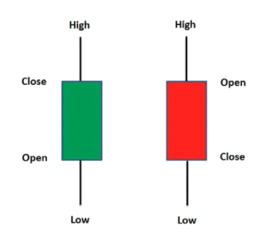
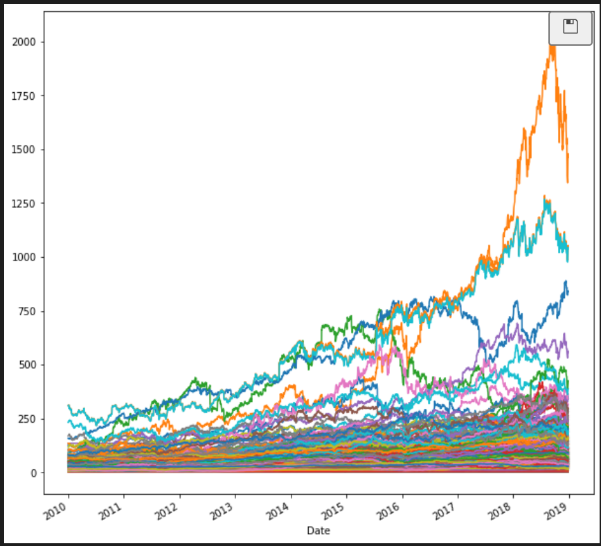

## This report contains methods, metrics and outcomes.

# Understanding the financial data
- The financial data that I used has 8 different columns.

- The other columns can be seen in the above figure.
- Open:The price at which the financial security opens in the market when trading begins 
- Close: The last price at which a security traded during the regular trading day.
- High: Biggest value in trading day.
- Low: Lowest value in trading day.
- Adj close: The adjusted closing price amends a stock's closing price to reflect that stock's value after accounting for any corporate actions.
# The below is an example plot of values respect to the date.

