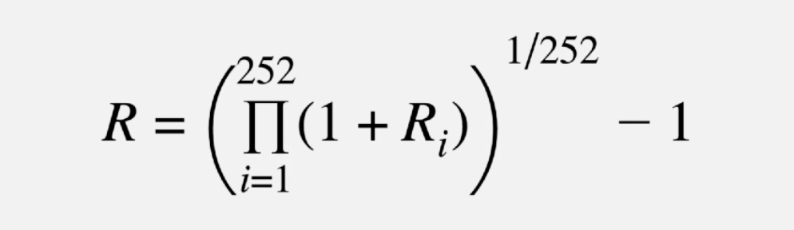
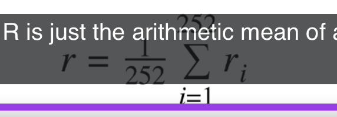
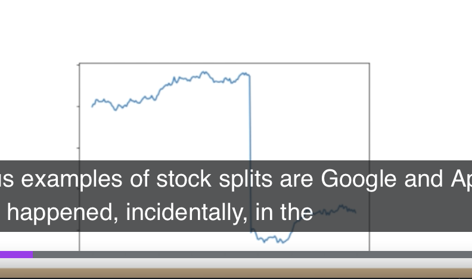
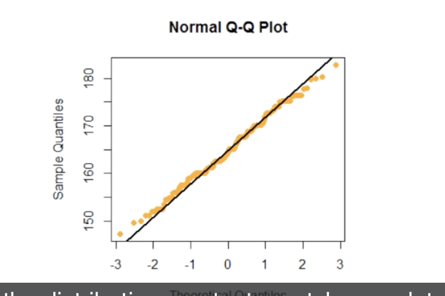
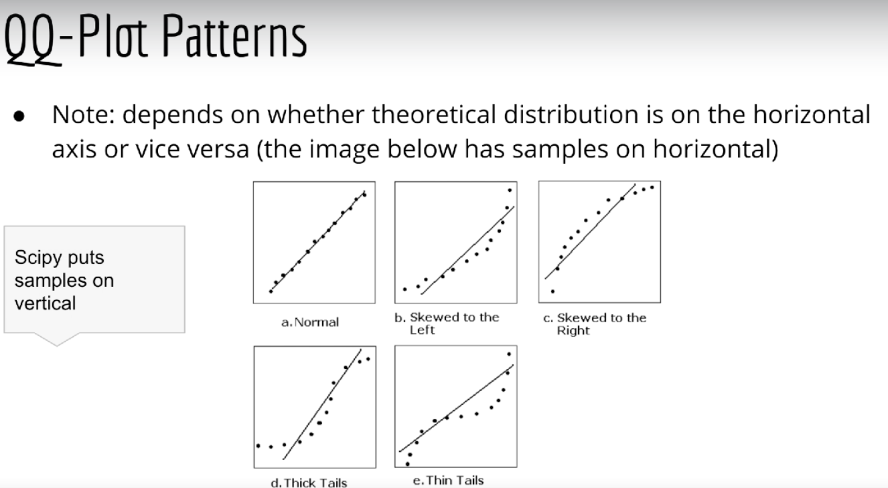

## This report contains methods, metrics and outcomes.

# Understanding the financial data
- The financial data that I used has 8 different columns.

- The other columns can be seen in the above figure.
- Open:The price at which the financial security opens in the market when trading begins 
- Close: The last price at which a security traded during the regular trading day.
- High: Biggest value in trading day.
- Low: Lowest value in trading day.
- Adj close: The adjusted closing price amends a stock's closing price to reflect that stock's value after accounting for any corporate actions.
# The below is an example plot of values respect to the date.

## There is no any trading for stock data In weekends. There are some strategies to fill the price values for that days. Backfill and Forwardfill are most common ones.
## In here my strategy is ; first forwardfill then backfill.

#Net return is equal to: net return R = (Pfinal - Pinitial) /Pinitial
Rt = pt- P(t-1) / p(t-1)
gross return:
1+Rt   1.2 times what I get.

log return:
 rt=log(1+Rt)=logpt-logpt-1

cumulative return
p252= p0(1+r1).(1+r2)..(1+r252)

average dailty return
r =()

Adj close:

stock split
1 share create 2 share
100 share for 100 per share
2-for-1 split
200 share each worth 50 dollar.

actual return are the actual prices.

dividens payments to make more resarhc.

qq-plot(normal gaussian dist)
inverse of cumlativedistfunc.
95 percent of class <6feet tall

qq-plot
a plot of sample quantiles vs thr quantiles(assumed dist)

prob plot
quantiles are just the lines that divide data into equally sized groups

T-distribution
fat tail

