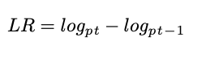

## This report contains methods, metrics and outcomes.

# Understanding the financial data and methods

- The financial data that I used has 8 different columns.

- The other columns can be seen in the above figure.
- Open: The price at which the financial security opens in the market when trading begins 
- Close: The last price at which a security traded during the regular trading day.
- High: Biggest value in trading day.
- Low: Lowest value in trading day.
- Adj close: The adjusted closing price amends a stock's closing price to reflect that stock's value after accounting for any corporate actions.
# The below is an example plot of values respect to the date.

# Missing data for stocks
There is no any trading for stock data in weekends. There are some strategies to fill the price values for that days. Backfill and Forwardfill are most common ones and I used both of them.
# Return Parameters
There are different kinds of returns. Examples are given below.
* Net return is equal to : 
As a value
  
As a time,

* Gross Return: 

* Log Return:

* cumulative return:

# Trend - following strategy 

- FastSMA, SlowSMA, different moving avarages have different drawbacks. SlowSMA for example can contain last 30 days but it is slower. FastSMA is more fast.

- Whenever Fast Crosses slow from below = BUY.
- Whener Fast Crosses slow from aboe = SELL.
- Wht it is make sense because fastSMA taking new trend however slowsma can not take this trend. Stock is trending downoard.

## Assumptions and restrictions
- No short-selling(hold stock or hold cash)
- only a single stock/ asset
- always byt/sell entirety of our holdings.
- Timing right.
- we doing some actions. In here we maniplate in a datafram
- paper-trading- simulating what would happen in a live enivronment

- trading logic and the market
- sanity check.

p(t-1)   rt
pt      r(t+1)

# Machine learning 
 Maybe we need the predict just one day
 used every data just select one data
 buildt a model buy sell nothing on return prediction
 use stock return
 ml models are not good at exptrapolation
 return are stationary

