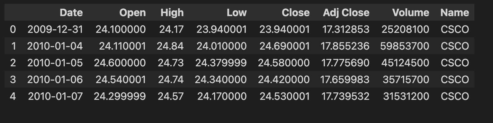

# price-prediction
# Preconditions/Run below commands on terminal.
    docker pull timescale/timescaledb-ha:pg14-latest
-----
    docker run -d --name timescaledb -p 5432:5432 -e POSTGRES_PASSWORD=password timescale/ timescaledb:latest-pg14
--------
    docker exec -it timescaledb psql -U postgres
-------
- run sql commands that inside the data-related/create_tables.sql
## Second Step
- - - - - 
    cd src
---------
    python3 -m venv venv
---------
    pip3 install -r requirments.txt
-------
    mlflow server \
    --backend-store-uri sqlite:///mlflow.db \
    --default-artifact-root ./mlflow-artifact-root \
    --host 0.0.0.0

 - open mlflow and create two experiment: random_f, logistic_f
- streamlit run stream_serve.py
# GOAL
- making a complete solution for price prediction problem.

# General Report
## This report contains methods, metrics and outcomes.

# Understanding the financial data and methods

- **Financial data can be obtained in different ways. I used [yfinance library](https://pypi.org/project/yfinance/) to get financial data. The below figure shows an example of data format.**

- **Financial data usually represented as a candlestick chart. The above figure illustrates the dataframe as a candle**.
- **Open: The price at which the financial security opens in the market when trading begins.** 
- **Close: The last price at which a security traded during the regular trading day.**
- **High: Biggest value in trading day.**
- **Low: Lowest value in trading day.**
- **Adj close: The adjusted closing price amends a stock's closing price to reflect that stock's value after accounting for any corporate actions.**
- **Volume: It is the amount of an asset or security that changes hands over some period of time, often over the course of a day.**

# The challenges in the data part.

1. **Missing data**: There is no any trading for stock data in weekends. There are some strategies to fill the price values for that days. Backfill and Forwardfill are most common ones and I used both of them.
2. **Daily Data**: Yfinance library has different options for obtaining data. I used 5 minutes interval options.

3. **Feature Engineering**: I generated almost 20 new features from the raw price data. RSI, VWAP, Moving Averages and other indicators were generated.

4. **Storage:** TimeScale database mainly used for the storage purpose. It is suitable for the stock data because It has time-series features.

The other challanges and will be mentioned after Return parameters part.
# Return Parameters
**There are different kinds of returns and examples  are given below.**

* **Net return is equal to :** 
    
      
* **Net return can be shown as below respect to the time**:

    

* **Gross Return**: 

    
* Log Return:

    
* **Cumulative return**:

    

There are different type of returns and they can be used to determine whether a stock is making a profit. We will use this information to classify the data.
# Transformed dataset:
|   ('MSFT_Close',) |   ('MSFT_Rsi14',) |   ('MSFT_Sma9',) |   ('MSFT_Sma180',) |   ('MSFT_Sma9_var',) |   ('MSFT_Sma180_var',) |   ('MSFT_Spread',) |   ('MSFT_Spread14_e',) |   ('MSFT_Volume14',) |   ('MSFT_Volume34',) |   ('MSFT_Volume14_34_var',) |   ('MSFT_Vwap',) |   ('MSFT_vwap_var',) |   ('GOOG_Close',) |   ('GOOG_Rsi14',) |   ('GOOG_Sma9',) |   ('GOOG_Sma180',) |   ('GOOG_Sma9_var',) |   ('GOOG_Sma180_var',) |   ('GOOG_Spread',) |   ('GOOG_Spread14_e',) |   ('GOOG_Volume14',) |   ('GOOG_Volume34',) |   ('GOOG_Volume14_34_var',) |   ('GOOG_Vwap',) |   ('GOOG_vwap_var',) |   ('UBER_Close',) |   ('UBER_Rsi14',) |   ('UBER_Sma9',) |   ('UBER_Sma180',) |   ('UBER_Sma9_var',) |   ('UBER_Sma180_var',) |   ('UBER_Spread',) |   ('UBER_Spread14_e',) |   ('UBER_Volume14',) |   ('UBER_Volume34',) |   ('UBER_Volume14_34_var',) |   ('UBER_Vwap',) |   ('UBER_vwap_var',) |   ('AAPL_Close',) |   ('AAPL_Rsi14',) |   ('AAPL_Sma9',) |   ('AAPL_Sma180',) |   ('AAPL_Sma9_var',) |   ('AAPL_Sma180_var',) |   ('AAPL_Spread',) |   ('AAPL_Spread14_e',) |   ('AAPL_Volume14',) |   ('AAPL_Volume34',) |   ('AAPL_Volume14_34_var',) |   ('AAPL_Vwap',) |   ('AAPL_vwap_var',) |   ('NVDA_Close',) |   ('NVDA_Rsi14',) |   ('NVDA_Sma9',) |   ('NVDA_Sma180',) |   ('NVDA_Sma9_var',) |   ('NVDA_Sma180_var',) |   ('NVDA_Spread',) |   ('NVDA_Spread14_e',) |   ('NVDA_Volume14',) |   ('NVDA_Volume34',) |   ('NVDA_Volume14_34_var',) |   ('NVDA_Vwap',) |   ('NVDA_vwap_var',) |   ('MSFT_Prev_close',) |   ('MSFT_Return',) |   ('MSFT_Log_Return',) |   ('AAPL_Prev_close',) |   ('AAPL_Return',) |   ('AAPL_Log_Return',) |   ('NVDA_Prev_close',) |   ('NVDA_Return',) |   ('NVDA_Log_Return',) |   ('UBER_Prev_close',) |   ('UBER_Return',) |   ('UBER_Log_Return',) |   ('MSFT_Shifted_Log_Return',) |   ('AAPL_Shifted_Log_Return',) |   ('NVDA_Shifted_Log_Return',) |   ('UBER_Shifted_Log_Return',) |
|------------------:|------------------:|-----------------:|-------------------:|---------------------:|-----------------------:|-------------------:|-----------------------:|---------------------:|---------------------:|----------------------------:|-----------------:|---------------------:|------------------:|------------------:|-----------------:|-------------------:|---------------------:|-----------------------:|-------------------:|-----------------------:|---------------------:|---------------------:|----------------------------:|-----------------:|---------------------:|------------------:|------------------:|-----------------:|-------------------:|---------------------:|-----------------------:|-------------------:|-----------------------:|---------------------:|---------------------:|----------------------------:|-----------------:|---------------------:|------------------:|------------------:|-----------------:|-------------------:|---------------------:|-----------------------:|-------------------:|-----------------------:|---------------------:|---------------------:|----------------------------:|-----------------:|---------------------:|------------------:|------------------:|-----------------:|-------------------:|---------------------:|-----------------------:|-------------------:|-----------------------:|---------------------:|---------------------:|----------------------------:|-----------------:|---------------------:|-----------------------:|-------------------:|-----------------------:|-----------------------:|-------------------:|-----------------------:|-----------------------:|-------------------:|-----------------------:|-----------------------:|-------------------:|-----------------------:|-------------------------------:|-------------------------------:|-------------------------------:|-------------------------------:|
|           298.625 |           45.9266 |          474.366 |            698.138 |            -0.367619 |              -0.574604 |         0.00041876 |             0.00283214 |          1.41772e+06 |               995999 |                   -0.289315 |          193.901 |             0.540094 |           2728.82 |           60.5922 |          746.478 |            698.155 |               2.6818 |                2.92544 |         0.00297042 |             0.00297042 |          1.41555e+06 |               957727 |                   -0.290241 |          2731.49 |          -0.00097746 |           32.0388 |           42.6992 |          758.585 |            698.149 |            -0.957368 |               -0.95405 |           0.012976 |             0.00833053 |          1.32246e+06 |               799593 |                    -0.18699 |          98.1826 |            -0.673682 |            164.07 |           43.5779 |          473.718 |             683.91 |             -0.65167 |              -0.759142 |        0.000243698 |             0.00524133 |          1.14158e+06 |               805008 |                   -0.113364 |          140.879 |             0.164614 |            264.96 |           45.7648 |          474.216 |            698.147 |            -0.435527 |              -0.620954 |        0.000150976 |             0.00368405 |               937247 |          1.02017e+06 |                   -0.295767 |          180.674 |             0.466506 |                    nan |                nan |                    nan |                    nan |                nan |                    nan |                    nan |                nan |                    nan |                    nan |                nan |                    nan |                     0.00252508 |                     0.00571283 |                     0.00129975 |                     0.00935721 |

- **The above one line is an example of columns that I used to classify the stock data. There are 13 columns for each stocks.**
- **To determine the stock is profit or not. I took log return values of every stock in a daily basis. I used log return because usually stock returns in daily basis are very small.**
- **Features have different effects on the learining phase and the most effective features are MSFT_Sma9_var, MSFT_Sma180_var and other _var features because they are propotional with the close and volume columns.**

# Machine Learning Models
- **During the research time, I tried different ML algorithms and most of them were not succesfull to predict. Most of the time computer scientist see machine learning models as black boxes. Although machine learning models are mostly black boxes and most of the time just accuracy metrics are important for the scientists, if we understand the reasons behind predictions, the untrustworthy models can be transformed into trusty ones.**
- **I used three different ML models(Linear Regression, Logistic Regression and Random Forest)**
- **The advanced model is not mean sucessful predictions. The most important thing is data.** 
## Random Forest
-----------
- **First, the data were prepared as shown in the transformed data part.**

- **Second, I trained the model with 70 percent of the data and validate it on the remaning 30 percent .**

- **The third step is the take roc_auc_score to see performance of the model.**
 
- **roc_auc_score is 0.79 in above image. It is a good score but there is a possibility to make higher score.**
- **I tuned the hyperparameters of random forest model using  RandomizedSearchCV.**
 
 
- **After finding the best set of parameters, again I trained the model.**
 
- **roc_auc_score is 0.82 in above image. There is a slight improvement.**

## Logistic Regression
-------------------
- **Same steps with Random Forest**.
- **roc_auc_score is 0.81 in below image.**
 

# Model deployment

- **The Main structure of the project is shown in the above figure.**
- **As you can see in the figure, after traning the models, models are uploaded to the local database with MLflow.**
- **MLflow is an open source platform for managing the end-to-end machine learning lifecycle. It tackles three primary functions: Model tracking, deploying and managing.**

- **The above figure is belongs to the project. As you can see, we can see the models version, accuracy scores, model trained time.**

# Streamlit
- **Streamlit is an open-source Python library that makes it easy to create and share, custom web apps for machine learning and data science.**

- **The above picture shows the main screen of the application.**
- **In the left side of the screen there is a page navigation. It consist of two different models at the moment.**
- **Input text area is located at center of the screen. There are three options.**
- **If we want to train model with the latest data, we need to write "Train" to the input text area.**

- **After we write train and select which stock model ratings we want to see, Latest data and accuracy metrics are shown. Also, the roc curve is drawn.**
- **If we want to Test the model with custom input, we need to write Test into input text area.**
- **[Train Video Link](https://youtu.be/bv78nMkvdy8)**

- **A .csv file can be uploaded to the project as shown in the figure and the existed model performance can be seen.**

- **[Test Video Link](https://youtu.be/THKfDwFoV7o)**
- **Models can be download by writing Download to input text area.**

- **[Test Video Link](https://youtu.be/XBuOoy762Vc)**

# Conclusion
- The project offer an End-to-end machine learning solution.(Data collection, training, deployment)
- The project has a web app and it can easily deployed to the cloud.(Streamlit, Heroku)
- Model Tracking can be done.
- Accuracy score mainly dependa on the features for stock price prediction.

# References
- [Financial Engineering and Artificial Intelligence in Python](https://www.udemy.com/course/ai-finance/)
- [Stock Closing Price Prediction using Machine Learning Techniques](https://www.sciencedirect.com/science/article/pii/S1877050920307924/)
